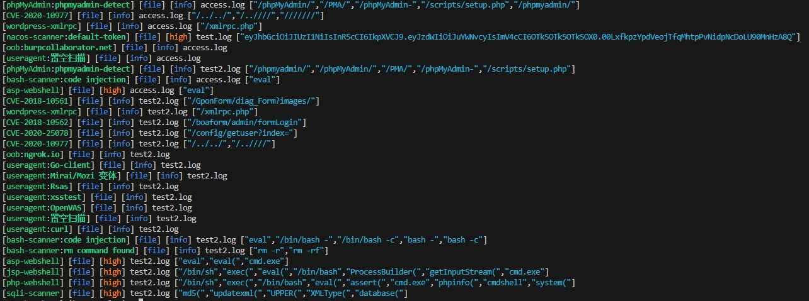

# NLA

使用 Nuclei 进行日志痕迹检测

辅助蓝队人员检测WEB日志中的攻击痕迹

---
## 已支持
- [x] webshell
- [x] oob
- [x] sqli
- [x] useragent
- [x] nacos
- [x] jeecgboot
- [x] wordpress
- [x] hikvision
- [ ] jenkins
- [x] dahua
- [ ] 泛微
- [ ] 致远
- [ ] 金蝶
- [ ] 用友
- [ ] 通达
- [ ] 亿赛通
- [x] Thinkphp
- [x] windows命令
- [x] linux命令


## 用法
```
nuclei -t /rules -u access.log -file
```
## 效果


## 注意事项
nuclei默认情况文件大于5 MB（5242880）将不会处理。遇到大文件请先分割。


## 参考链接:
> https://github.com/ffffffff0x/LOG-HUB

> https://github.com/projectdiscovery/nuclei-templates

> https://github.com/wy876/POC


[](https://starchart.cc/ahisec/nla)